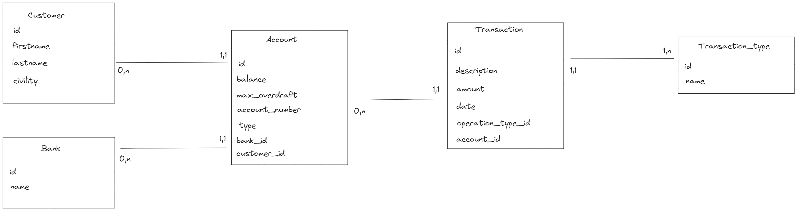

<h1>Itinov Bank</h1>

<h2>Contexte</h2>

Exercice Backend:

Bonne nouvelle, la société ITINOV a décidé de créer sa propre banque en ligne.
Votre mission, si vous l’acceptez, est de créer son logiciel à partir des user stories ci-dessous :

Préambule : Je suis un client déjà authentifié sur le portail (ce use case n’est pas à traiter). La devise de toutes les transactions est l’euro. User stories :

- En tant que client, je veux pouvoir accéder à la liste de mes comptes
- En tant que client, je veux pouvoir déposer des devises sur mes comptes.
- En tant que client, je veux pouvoir retirer des devises depuis mes comptes.
- En tant que client, je veux pouvoir effectuer des virements entre mes différents comptes.
- En tant que client, je veux pouvoir consulter l’historique des opérations effectuées sur mes comptes (date, montant, type, par qui, solde…). Si une opération de retrait ou virement fait dépasser le seuil du découvert, celle-ci est refusée.

Exercice Frontend:

Reprendre les fonctionnalités de l’exercice back. Les appels correspondant à ces fonctionnalités seront mockées pour l’exercice front. En tant que développeur front, une API est à votre disposition afin d’effectuer ces opérations, ce qui vous est demandé est :
En supposant que l’utilisateur est déjà connecté :

- Avoir un dashboard sur une page permettant de :
  - Voir la liste des comptes
  - Sur ce dashboard, pour chaque compte :
- Voir leur solde
- Voir les dernières opérations effectuées
- Un bouton permettant d’effectuer une opération de retrait (on fera comme si on recevait des billets suite à l’opération)
- Un autre bouton pour effectuer un virement d’un compte à l’autre (endpoint d’API différent mais mocké encore une fois)
- Etre alerté si mon solde est débiteur via un indicateur visuel
- Une vue (au choix du développeur) pour le retrait d’argent.
- Une vue (au choix du développeur) pour le transfert d’argent d’un compte vers un autre. Petites règles d’affichage :
- On aimerait que tout ce qui est positif niveaux montants s’affiche en vert, et le négatif en rouge.
- En bonus facultatif, dans le dashboard principal, avoir un graphique des opérations effectuées sur le solde dans le mois courant. (Avec données mockées, et librairie de charts de votre choix)

<h2>Environnement technique et Frameworks </h2>

- NodeJS v20.10.0 (devrait fonctionner sur une version 18 également)
- Yarn v1.22.19
- React v18
- Nest v10
- Langage: Typescript
- BDD: MySQL v8

<h3> Packages principaux Frontend </h3>

<ul>
  <li> Framework: React </li>
  <li> Routing: React Router Dom </li>
  <li> Style: TailwindCSS </li>
  <li> State Management: React Query</li>
  <li> Graphiques: Recharts </li>
  <li> Tests: Vitest + Testing Library </li>
</ul>

<h3> Packages principaux Backend </h3>

<ul>
  <li> Framework: Nestjs </li>
  <li> ORM: TypeORM </li>
  <li> Connecteur BDD: Mysql2 </li>
  <li> Documentation: Swagger </li>
  <li> Tests: Jest + Supertest
</ul>

<h2>Installation et lancement du projet</h2>

<h3> Base de données </h3>

Le projet est prévu pour tourner sous MySQL v8.

Une BDD est nécessaire pour run le projet, ainsi qu'une autre pour lancer les tests d'intégration.

Ces deux DB sont à reporter dans le fichier .env (voir prochaine section)

Le fichier **script.sql** situé dans le dossier data permet d'importer les données à mettre en place pour utiliser l'application
Le fichier **test-script.sql** situé dans le même dossier permet d'importer les données utilisées pendant les tests

<h3>Backend</h3>
A la racine du dossier backend, créer un fichier .env et remplir les variables suivantes:

- DB_HOST=
- DB_PORT=
- DB_USERNAME=
- DB_PASSWORD=
- DB_NAME=
- DB_TEST_NAME=
- APP_PORT=

Depuis un terminal positionné dans le dossier backend:

- Installer les dépendances avec <code>yarn</code>
- Lancer le projet avec <code>yarn start:dev</code> ou <code>yarn start</code>
- Pour lancer les tests, utiliser <code>yarn test</code> et <code>yarn test:cov</code> pour la coverage

Une fois le projet lancé, la documentation Swagger est disponible à http://localhost:APP_PORT/api/docs

<h3>Frontend</h3>

A la racine du dossier frontend:

- Créer un fichier .env et remplir la variable suivate (avec suffixe /api/v1 - ex http://localhost:4000/api/v1):
  VITE_API_URL=

Depuis un terminal poisitionné dans le dossier frontend:

- Installer les dépendances avec <code>yarn</code>
- Lancer le projet avec <code>yarn dev</code>
- Pour lancer les tests, utiliser <code>yarn test</code> et <code>yarn test:cov</code> pour la coverage

<h2>Architecture</h2>

Séparation en 3 couches Présentation / Business / Persistance

<h3>Modèle de données retenu</h3>

Compte tenu des consignes, le modèle suivant a été retenu:

<h3>Architecture de code backend</h3>

Au sein du dossier src:

- app: contient le app module, qui appelle tous les autres, ainsi que du code d'initialisation
- common: classes réutilisables d'un projet sur l'autre avec très peu de changement
- features: modules liés à la logique métier

Chaque feature est regroupée dans un module, les nom des fichiers représentent leur fonction.

Si interaction avec la BDD, une implémentation Repository est également en place dans un fichier .repository

Les représentations des objets en BDD sont suffixées par .entity.ts

Les objets de validation sont suffixés par .dto.ts

<h3>Architecture de code frontend</h3>

Au sein du dossier src:

- config: des configurations utilitaires réutilisables d'un projet à l'autre
- features: tout ce qui est lié avec la logique métier du projet. On trouve pour chaque feature des components, des utilitaires ou des useCase faisant appel à l'api
- shared: composants et fonctions globalement liés au projet et avec de la logique métier, mais pas une feature en particulier
- router: contient les routes du projet
- ui: des composants extrêmement simples et réutilisables, vides de toute logique métier, réutilisables d'un projet à l'autre

<h2>Ce qui n'a pas été implémenté</h2>

- Pagination sur les transactions: le backend renverra pour l'instant les 50 dernières transactions, au delà il n'est pas possible d'accéder à l'historique.
- Quelques tests sont à revoir
- Quelques requêtes SQL implémentées en raw, pas évident à maintenir
